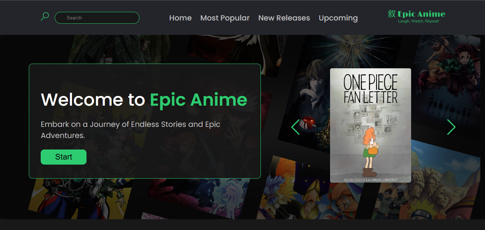
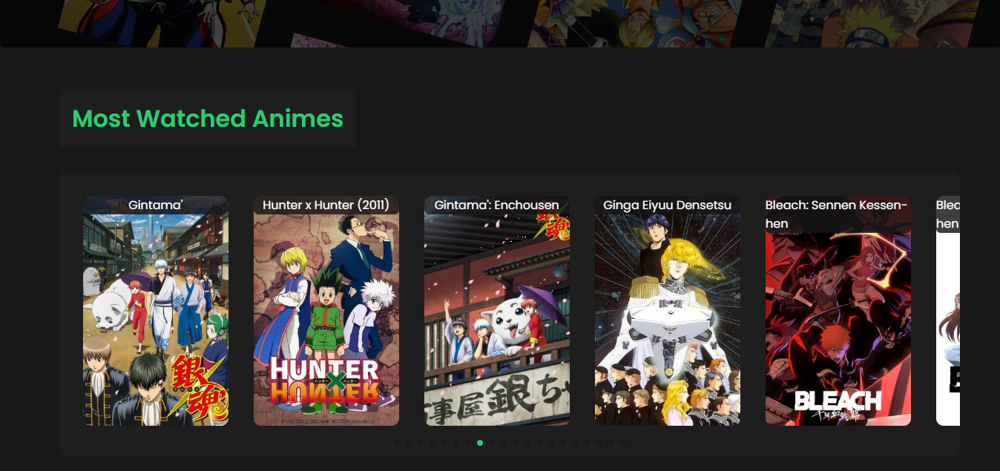
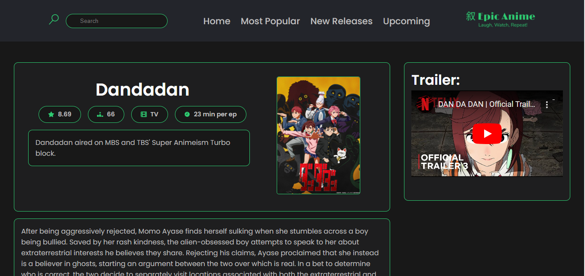

# 📺 **Epic Anime**
*"Epic Animes oferece um catálogo completo e atualizado com seus títulos favoritos, dos clássicos aos lançamentos mais recentes. Explore sinopses detalhadas. Tudo isso com uma interface intuitiva e otimizada para garantir a melhor experiência. Seu hub definitivo para acompanhar seus animes e mangás favoritos, com atualizações em tempo real!"*
### 📷 **Imagem do Site:**

## ✨ **Recursos**
- 📖 Catálogo atualizado de mangás e animes.  
- 🔍 Pesquisa fácil com filtros avançados (gênero, popularidade, etc.).  
- 📊 Estatísticas de visualização e tendências.
## 🖥️ **Tecnologias Utilizadas**
- **Frontend:** React.js
- **Backend:** Node.js
- **Outros:** Jikan API
## 📚 **Documentação da API**
- **API:** https://docs.api.jikan.moe/
## 🖼️ **Imagens do Projeto**
  
